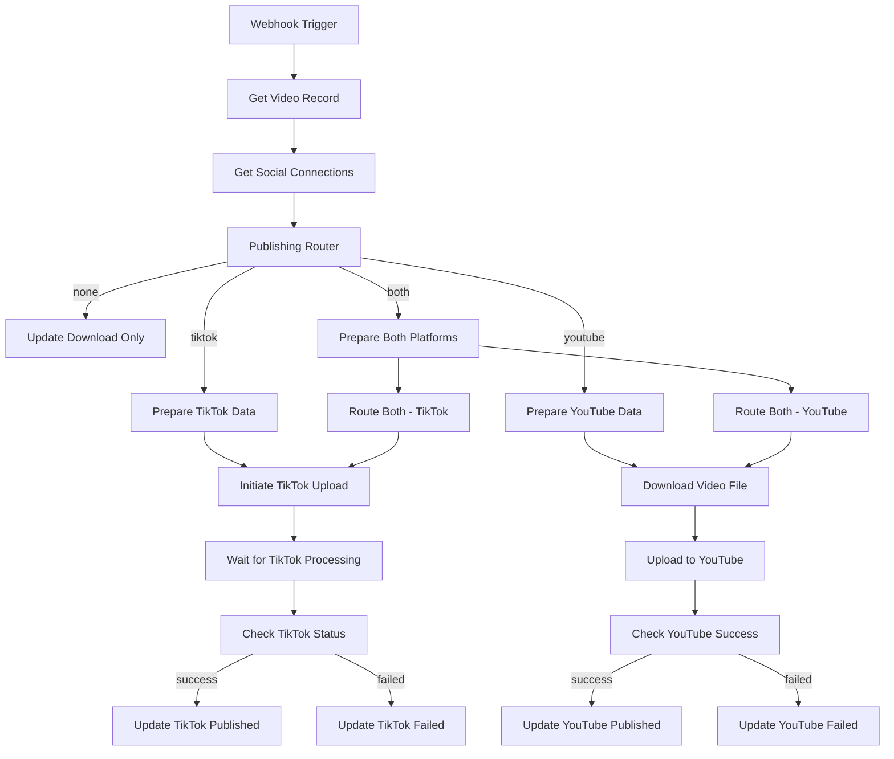

# ShortsForge Publishing Workflow - Data Flow Guide

## Overview

The publishing workflow handles social media distribution of generated videos. It receives webhook calls from the creation workflow and publishes videos to TikTok, YouTube, or both platforms based on user preferences.

## Webhook Input (Postman Testing)

### **Endpoint**: `POST /webhook/shortsforge-publish-video`

### **Expected Payload**:
```json
{
  "videoId": "uuid-from-user_videos-table",
  "userId": "user-uuid",
  "publishAction": "none|tiktok|youtube|both",
  "videoUrl": "https://shotstack-rendered-video-url.mp4",
  "title": "Video Title",
  "scriptText": "Video script content"
}
```

### **Required Fields**:
- `videoId`: Primary key from `user_videos` table
- `userId`: User identifier
- `publishAction`: Publishing destination

## Data Flow Architecture



## Node-by-Node Data Flow

### **1. Webhook - Video Ready for Publishing**
- **Type**: `n8n-nodes-base.webhook`
- **Input**: HTTP POST request from creation workflow
- **Output**: Raw webhook payload
- **Purpose**: Triggers the publishing process

---

### **2. Get Video Record**
- **Type**: `n8n-nodes-base.supabase`
- **Input**: `videoId` from webhook payload
- **Database Query**:
  ```sql
  SELECT * FROM user_videos WHERE id = {{ $json.body.videoId }}
  ```
- **Output**: Complete video record with metadata
- **Key Fields**: `title`, `script_text`, `final_video_url`, `status`

---

### **3. Get User Social Connections**
- **Type**: `n8n-nodes-base.supabase`
- **Input**: `userId` from webhook payload
- **Database Query**:
  ```sql
  SELECT * FROM social_connections
  WHERE user_id = {{ $json.body.userId }}
  AND is_active = true
  ```
- **Output**: Array of active social media connections
- **Key Fields**: `platform`, `access_token`, `expires_at`, `platform_username`

---

### **4. Publishing Router**
- **Type**: `n8n-nodes-base.switch`
- **Input**: `publishAction` from webhook
- **Logic**:
  - Output 0: `publishAction === "none"` → Download Only
  - Output 1: `publishAction === "tiktok"` → TikTok Publishing
  - Output 2: `publishAction === "youtube"` → YouTube Publishing
  - Output 3: `publishAction === "both"` → Both Platforms
- **Purpose**: Routes to appropriate publishing branch

---

## TikTok Publishing Branch

### **5. Prepare TikTok Data**
- **Type**: `n8n-nodes-base.code`
- **Input**: Social connections array + video record
- **Processing**:
  ```javascript
  // Filters for valid TikTok connection
  const tiktokConnection = connections.find(conn =>
    conn.platform === 'tiktok' &&
    conn.is_active &&
    new Date(conn.expires_at) > new Date()
  );
  ```
- **Output**: TikTok connection data + video metadata
- **Error Handling**: Returns `hasValidConnection: false` if no valid connection

### **6. Initiate TikTok Upload**
- **Type**: `n8n-nodes-base.httpRequest`
- **API**: `POST https://open.tiktokapis.com/v2/post/publish/video/init/`
- **Headers**: `Authorization: Bearer {{ accessToken }}`
- **Payload**:
  ```json
  {
    "post_info": {
      "title": "{{ videoData.title }}",
      "description": "{{ videoData.scriptText }}",
      "privacy_level": "PUBLIC_TO_EVERYONE"
    },
    "source_info": {
      "source": "PULL_FROM_URL",
      "video_url": "{{ videoData.videoUrl }}"
    }
  }
  ```
- **Output**: TikTok `publish_id` for status tracking

### **7. Wait for TikTok Processing**
- **Type**: `n8n-nodes-base.wait`
- **Duration**: 5 seconds
- **Purpose**: Allow TikTok processing time before status check

### **8. Check TikTok Status**
- **Type**: `n8n-nodes-base.httpRequest`
- **API**: `POST https://open.tiktokapis.com/v2/post/publish/status/fetch/`
- **Payload**: `{"publish_id": "{{ publish_id }}"}`
- **Output**: Publishing status (`PUBLISH_COMPLETE`, `PROCESSING`, `FAILED`)

### **9. Check TikTok Complete**
- **Type**: `n8n-nodes-base.if`
- **Condition**: `$json.data.status === "PUBLISH_COMPLETE"`
- **Branches**: Success → Update Published, Failure → Update Failed

---

## YouTube Publishing Branch

### **10. Prepare YouTube Data**
- **Type**: `n8n-nodes-base.code`
- **Input**: Social connections array + video record
- **Processing**: Similar to TikTok, filters for valid YouTube connection
- **Output**: YouTube OAuth data + video metadata
- **Required**: `access_token`, `refresh_token`, `platform_username` (channel ID)

### **11. Download Video File**
- **Type**: `n8n-nodes-base.httpRequest`
- **URL**: `{{ videoData.videoUrl }}` (Shotstack rendered video)
- **Method**: GET
- **Configuration**:
  ```json
  {
    "options": {
      "response": {
        "responseFormat": "file"
      },
      "timeout": 60000
    }
  }
  ```
- **Output**: Binary video data for YouTube upload
- **Purpose**: Downloads video file as binary data for YouTube node

### **12. Upload to YouTube**
- **Type**: `n8n-nodes-base.youTube`
- **Operation**: `video.upload`
- **Configuration**:
  ```json
  {
    "resource": "video",
    "operation": "upload",
    "title": "{{ videoData.title }}",
    "description": "{{ videoData.description }}",
    "tags": "shorts,trending,viral",
    "categoryId": "22",
    "privacyStatus": "public",
    "binaryData": true,
    "binaryPropertyName": "data"
  }
  ```
- **Authentication**: `youTubeOAuth2Api` credentials
- **Output**: YouTube video object with `id`, `snippet`, `status`

### **13. Check YouTube Success**
- **Type**: `n8n-nodes-base.if`
- **Condition**: `$json.id` is not empty
- **Purpose**: Validates successful YouTube upload

---

## Database Updates

### **Update TikTok Published**
```sql
UPDATE user_videos SET
  publishing_status = 'published',
  tiktok_url = '{{ share_url }}',
  platform_post_id = '{{ publish_id }}',
  published_at = NOW()
WHERE id = '{{ videoId }}'
```

### **Update YouTube Published**
```sql
UPDATE user_videos SET
  publishing_status = 'published',
  youtube_url = 'https://youtube.com/watch?v={{ video_id }}',
  platform_post_id = '{{ video_id }}',
  published_at = NOW()
WHERE id = '{{ videoId }}'
```

### **Update Failed**
```sql
UPDATE user_videos SET
  publishing_status = 'publish_failed',
  publish_error = '{{ error_message }}'
WHERE id = '{{ videoId }}'
```

### **Update Download Only**
```sql
UPDATE user_videos SET
  publishing_status = 'download_only',
  published_at = NOW()
WHERE id = '{{ videoId }}'
```

## Authentication Requirements

### **TikTok OAuth2**
- **Required Scopes**: `video.publish`, `video.upload`
- **Token Fields**: `access_token`, `expires_at`
- **Validation**: Check expiration before upload

### **YouTube OAuth2**
- **Required Scopes**: `https://www.googleapis.com/auth/youtube.upload`
- **Token Fields**: `access_token`, `refresh_token`, `expires_at`
- **n8n Credential**: `youTubeOAuth2Api` with ID `youtube-oauth-credentials`

## Error Handling & Debugging

### **Common Issues**

1. **No Valid Social Connection**
   - **Symptom**: `hasValidConnection: false`
   - **Debug**: Check `social_connections` table for active, non-expired tokens
   - **Fix**: Re-authenticate user with platform

2. **Video Download Failed**
   - **Symptom**: HTTP Request error or empty binary data
   - **Debug**: Verify Shotstack video URL is accessible
   - **Fix**: Check video rendering status in creation workflow

3. **YouTube Upload Failed**
   - **Symptom**: YouTube node error or empty response
   - **Debug**: Check OAuth2 credentials and token expiration
   - **Fix**: Refresh YouTube credentials in n8n

4. **TikTok Upload Failed**
   - **Symptom**: API error or `publish_status: FAILED`
   - **Debug**: Check TikTok API quotas and video format requirements
   - **Fix**: Verify video meets TikTok specifications

### **Status Monitoring**

Query video publishing status:
```sql
SELECT
  id, title, status, publishing_status,
  tiktok_url, youtube_url, publish_error,
  generation_completed_at, published_at
FROM user_videos
WHERE id = 'your-video-id';
```

### **Environment Variables Required**

```env
# For large video file handling
N8N_DEFAULT_BINARY_DATA_MODE=filesystem
N8N_PAYLOAD_SIZE_MAX=16777216

# API Keys (store in n8n secrets)
TIKTOK_CLIENT_KEY=your_tiktok_client_key
YOUTUBE_CLIENT_ID=your_youtube_client_id
YOUTUBE_CLIENT_SECRET=your_youtube_client_secret
```

## Testing with Postman

### **1. Test Webhook Endpoint**
```bash
POST http://your-n8n-instance:5678/webhook/shortsforge-publish-video
Content-Type: application/json

{
  "videoId": "existing-video-uuid",
  "userId": "existing-user-uuid",
  "publishAction": "youtube",
  "videoUrl": "https://valid-video-url.mp4",
  "title": "Test Video Title",
  "scriptText": "Test script content"
}
```

### **2. Monitor Execution**
- Check n8n execution logs for each node
- Verify database updates in `user_videos` table
- Confirm actual uploads on TikTok/YouTube platforms

### **3. Expected Response**
- **No HTTP response** (workflow runs async)
- Check database for `publishing_status` updates
- Video should appear on selected social platforms

This workflow is now optimized for async publishing with proper error handling and comprehensive status tracking.